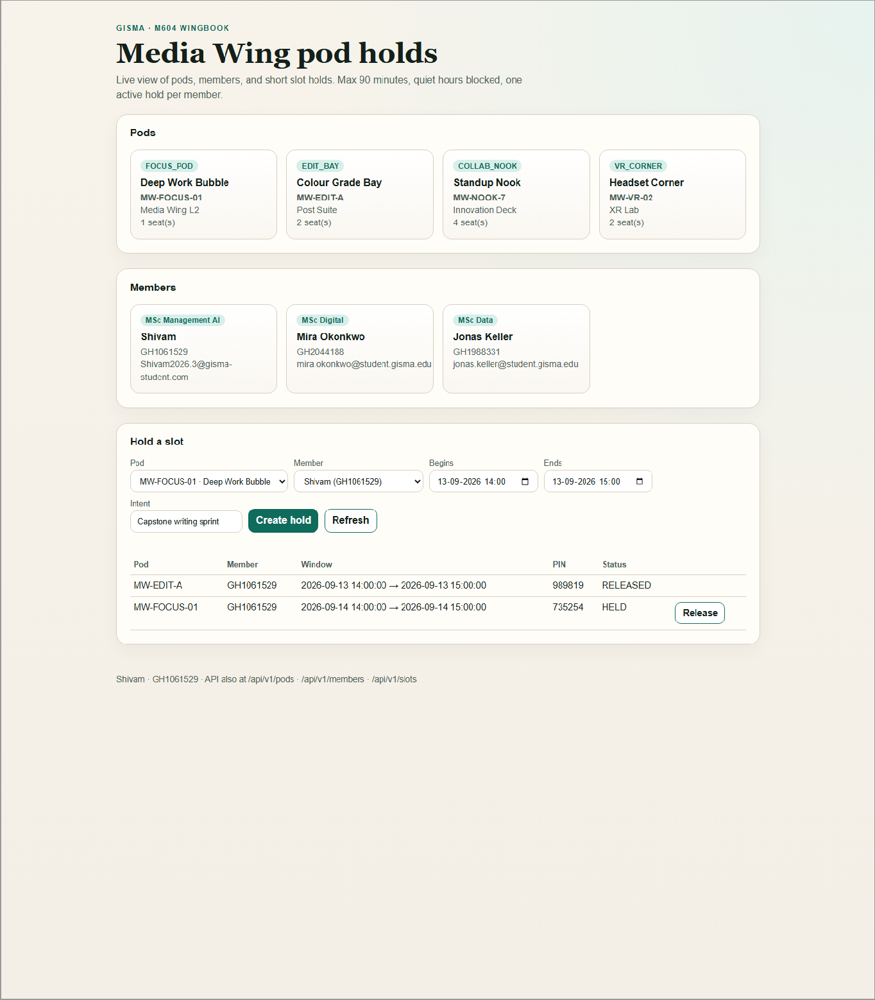
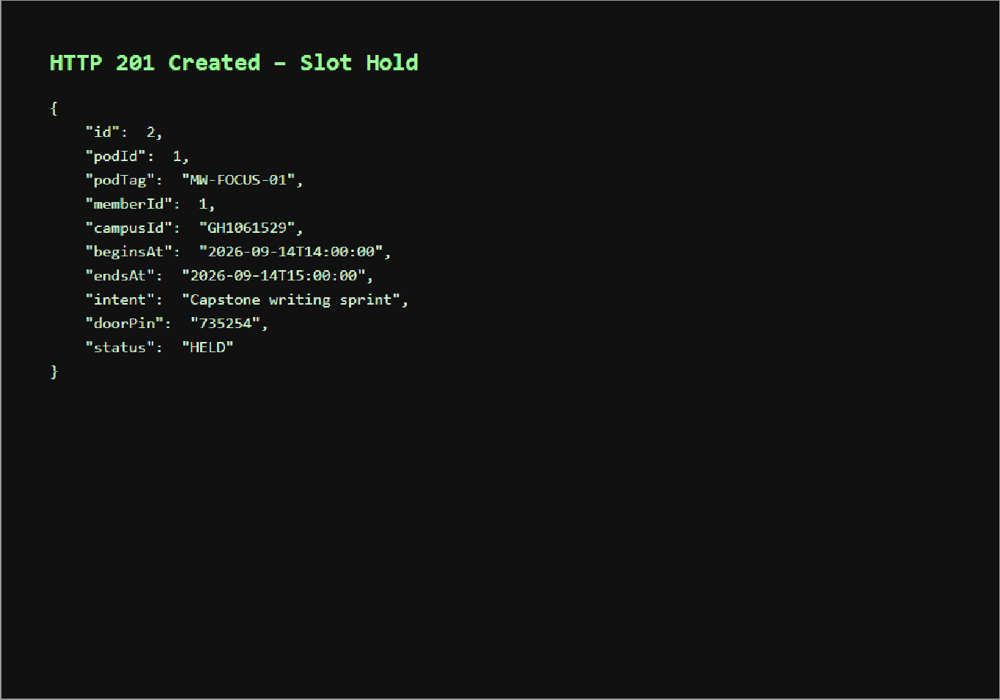
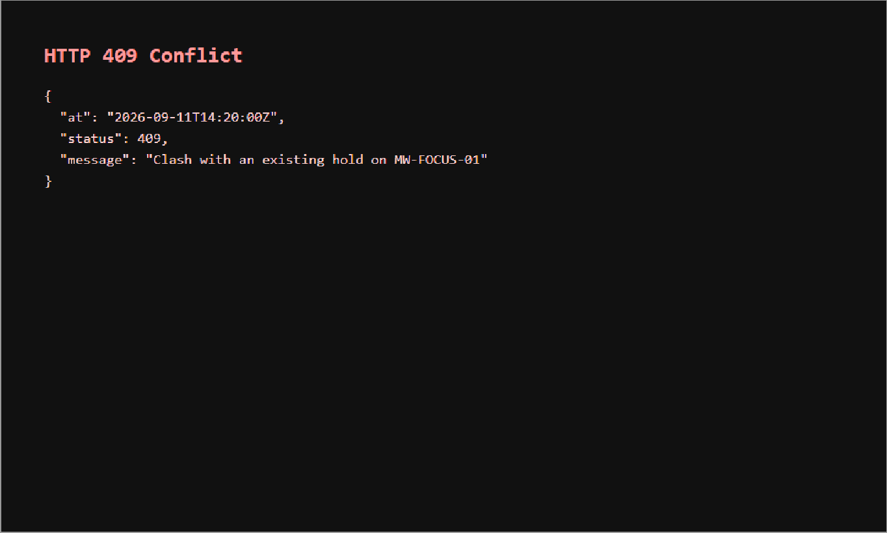
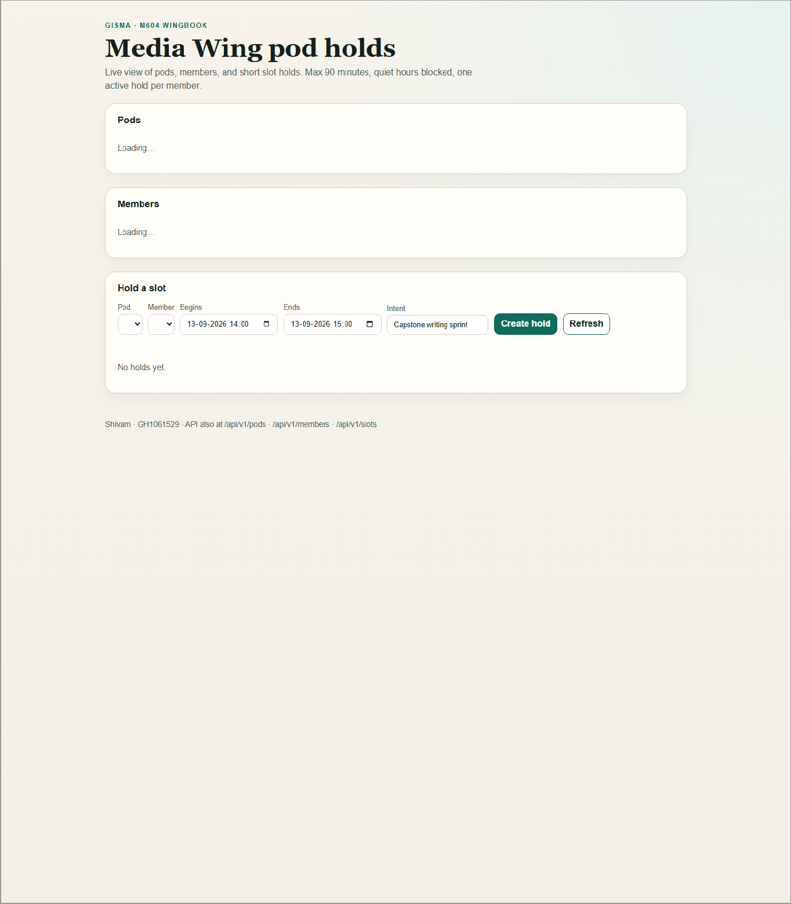
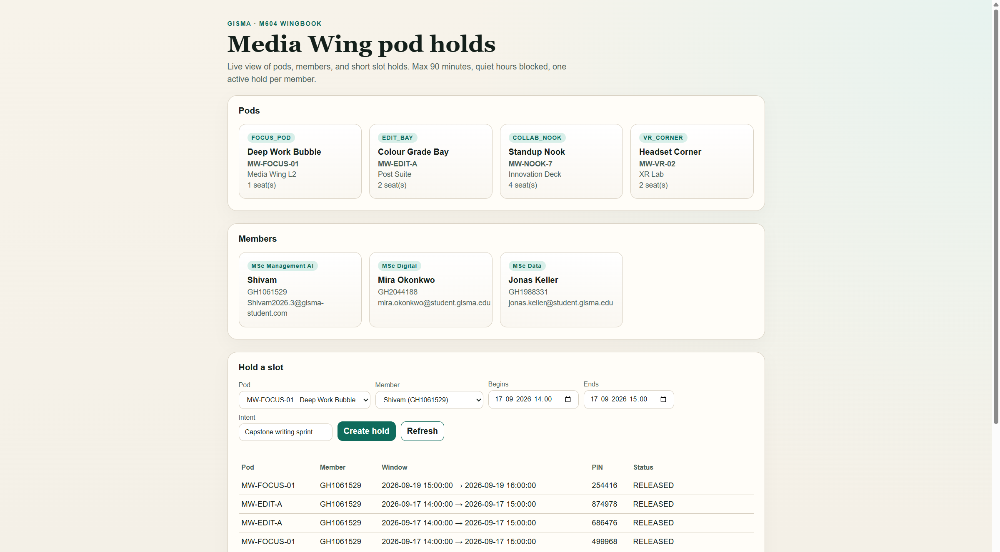
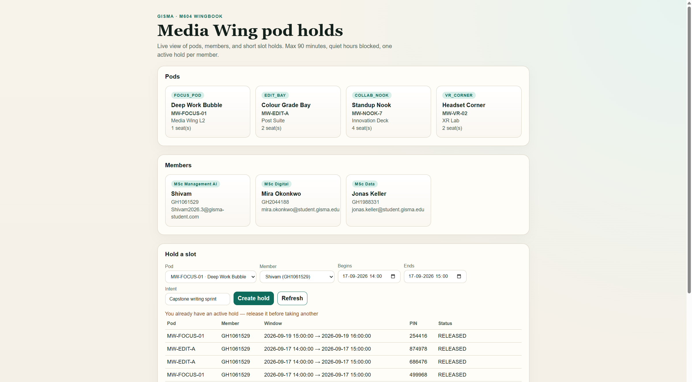
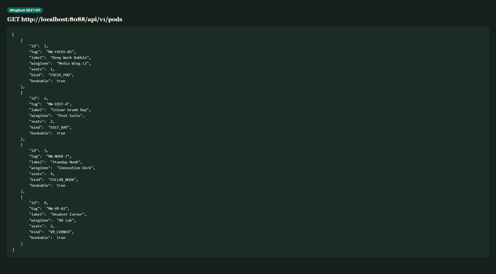
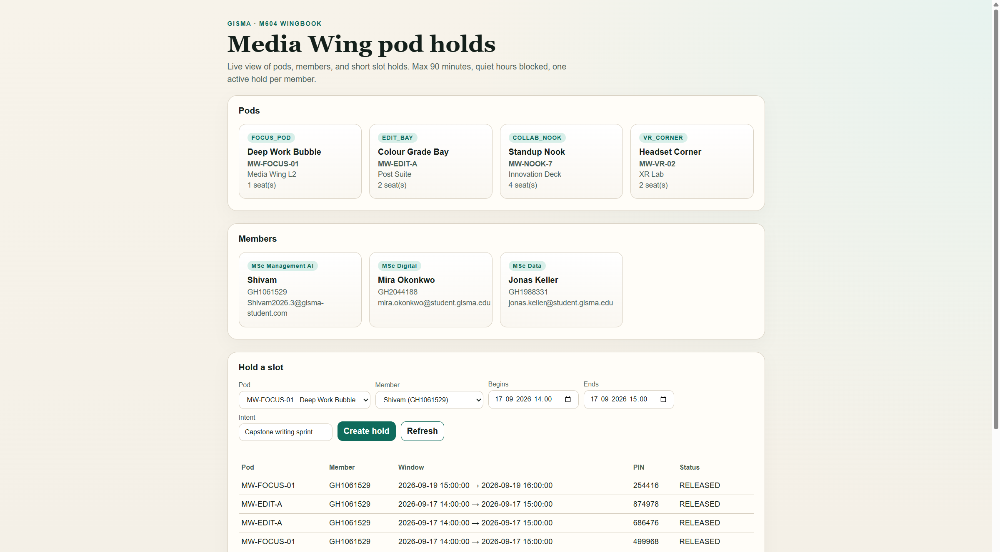

# WingBook (M604)

Spring Boot + MySQL API for booking **Media Wing study pods** (not generic lecture rooms).

Author: Shivam · GH1061529

## Why this project

Campus spaces get double-booked. WingBook holds short slots on focus pods / edit bays with rules that match how the wing actually runs:

- max **90 minutes** per hold
- **quiet hours** 22:00–07:00 blocked
- only **one active hold** per member
- each hold gets a random **door PIN**

## Stack

- Java 21, Spring Boot 3.4, Spring Data JPA, Validation
- MySQL 8 (Docker Compose on host port **3307**)
- App port **8088**

## Run

```bash
cd wingbook
docker compose up -d
mvn spring-boot:run
```

Open the live page: **http://localhost:8088/**

API still available under `/api/v1/...`

## API map

| Resource | Base path |
|----------|-----------|
| Pods | `/api/v1/pods` |
| Members | `/api/v1/members` |
| Slot holds | `/api/v1/slots` |
| Free check | `/api/v1/slots/free?podId=&beginsAt=&endsAt=` |
| Release | `POST /api/v1/slots/{id}/release` |

### Example hold

```json
POST /api/v1/slots
{
  "podId": 1,
  "memberId": 1,
  "beginsAt": "2026-09-22T14:00:00",
  "endsAt": "2026-09-22T15:00:00",
  "intent": "Capstone writing sprint"
}
```

Seeded pods: `MW-FOCUS-01`, `MW-EDIT-A`, `MW-NOOK-7`, `MW-VR-02`  
Seeded member includes `GH1061529` (Shivam).

## Screenshots

### Demo figures

**Figure 1 — Home UI (pods, members, active hold + PIN)**



**Figure 2 — Hold created (HTTP 201 API response)**



**Figure 3 — Clash blocked (HTTP 409 Conflict)**



**Figure 4 — UI loading state**



### Live captures

**Home page**



**Rule message on create hold**



**REST API — pods JSON**



**Full UI overview**


